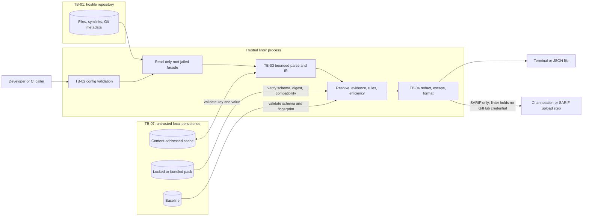
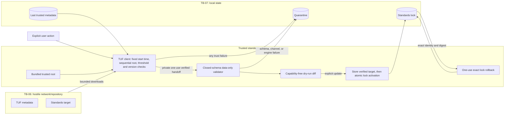

# Agent Context Linter threat model

| Document property | Value |
|---|---|
| Status | Security-review baseline for ticket A06 |
| Model version | 1.5 |
| Last reviewed | 2026-08-08 |
| Applies to | Stable `v1.0.0` architecture |
| Review owner | Security reviewer |

This document defines the security properties implemented by the Agent Context Linter release. Normal
scans are offline, read-only, and model-free. A future capability with different trust boundaries
would require a separately reviewed design before it could be added.

The model uses data-flow diagrams, trust boundaries, abuse cases, and STRIDE categories. This follows Microsoft's design-analysis use of STRIDE and OWASP's guidance to identify entry points, assets, data flows, and trust changes. The response process is in [Security response](security-response.md).

## 1. Scope and security objectives

### 1.1 In scope

- The packaged CLI, public library APIs, configuration loader, parsers, discovery, resolver, evidence collector, deterministic rules, formatters, baselines, and fixes.
- Bundled and locally locked standards packs, TUF metadata, explicit standards network commands, and their caches.
- CI execution and production of terminal, JSON, SARIF 2.1.0, and GitHub annotation output.
- Maintainer workflows that observe upstream specifications, build and publish standards packs, and
  build npm releases.
- Local caches, temporary files, lockfiles, baselines, and logs.

### 1.2 Out of scope

- Security of coding agents or repositories after the linter exits.
- Proving that instructions are safe to execute. The linter recognizes text; it does not authorize it.
- Security of model providers, GitHub, npm, TUF mirrors, operating systems, container runtimes, or CI platforms beyond safe integration and explicit assumptions.
- Host compromise by an administrator or an attacker already able to modify the linter executable and all of its trusted local state.

### 1.3 Mandatory security invariants

These are release-blocking invariants. No waiver is permitted for `v1.0.0`.

1. Ordinary `scan`, `list`, `explain`, `rules`, and `efficiency` execution is offline, model-free, read-only, and does not execute repository content.
2. Every repository-derived byte, path, filename, pattern, command-shaped string, configuration value, and cached value is untrusted data.
3. Reads and imports remain inside the selected repository root. External symlinks, special files, traversal, and filesystem races fail closed.
4. A normal scan never expands a shell expression, imports repository code, installs dependencies, runs hooks, initializes submodules, invokes build tools, or loads executable rule updates.
5. Output cannot emit raw secrets or active terminal control sequences. Machine-readable locations cannot escape the repository root.
6. Fixes are explicit, mechanical, previewed, conflict-free, compare-and-swap writes. A failure cannot produce a partial multi-file change.
7. Standards network access occurs only through an explicit check/update action or a separately recorded opt-in. CI never silently updates a lock.
8. Only threshold-verified, current, compatible, schema-valid, data-only TUF targets may become trusted standards state.
9. Security failures do not silently degrade into warnings or cached success. They abort the affected
   operation with a sanitized, actionable error.
10. Security-sensitive evidence is reproducible and attributable to engine, profile, standards-pack,
    configuration, repository, and schema versions without embedding secrets.

The production `explain` adapter preserves these invariants while composing dynamic evidence. It
reads trace JSON and import targets only through the C02 repository capability, normalizes the trace
through E03 before using any event, admits only known events supported by the selected profile, and
binds C10 graphs to same-process E04 DAGs before E05. Trace files cannot select paths outside the
root, uncertain events cannot manufacture activation, and explicit Cursor surface selection cannot
cross profile or disabled-surface boundaries.

Large deterministic CLI documents are fully validated against the 64 MiB output ceiling and
well-formed Unicode before their first standard-output write. They are then split on Unicode scalar
boundaries into at most 1 MiB chunks and awaited serially, retaining router-owned aggregate
accounting, cancellation, backpressure, and output-failure handling without partial output on
preflight rejection.

## 2. Assets and protection goals

| ID | Asset | Confidentiality | Integrity | Availability | Notes |
|---|---|---:|---:|---:|---|
| AS-01 | Repository source and instruction files | high when private | critical | high | Ordinary commands may read only the minimum required data; only an approved fix path may write. |
| AS-02 | User credentials, environment, home directory, SSH agents, cloud metadata, CI secrets | critical | critical | medium | Must not be read by untrusted workers, logged, or sent to a model. |
| AS-03 | Diagnostics, resolution graph, baseline, JSON/SARIF, and efficiency results | medium to high | high | medium | May reveal paths, snippets, policy, or security findings. |
| AS-04 | Linter executable, dependencies, npm artifact, build provenance, source maps | low | critical | high | Compromise affects every scan and update. |
| AS-05 | Bundled/locked standards packs, TUF root and metadata, standards lockfile | low | critical | high | Data-only does not mean trusted; activation requires cryptographic and schema checks. |
| AS-06 | Fix plan, original-content identity, temporary files, resulting file modes | medium | critical | high | Incorrect edits can damage a repository or alter executable behavior. |
| AS-07 | Local caches, cache keys, process locks, quarantine, temporary workspace | medium | high | medium | Cache is an optimization and must not become an authority boundary. |
| AS-08 | CI identity, `GITHUB_TOKEN`, OIDC identity, signing material, npm/TUF publication authority | critical | critical | high | Must be absent from untrusted analysis jobs and separated by role. |
| AS-09 | Maintainer source observations and upstream-spec review artifacts | medium | high | medium | Fetched content and summaries remain untrusted suggestions. |
| AS-10 | Security reports, incident evidence, embargoed fixes, revocation material | critical | critical | high | Handled under [Security response](security-response.md). |

## 3. Actors and adversaries

| Actor | Capability and intent | Trust decision |
|---|---|---|
| Local developer | Selects a root, configuration, command, profile, output path, and fixes. May make mistakes. | Authorized for the chosen repository, but input remains untrusted and destructive scope is constrained. |
| CI operator | Configures workflow permissions, artifacts, caches, and SARIF upload. | Trusted to configure policy; pull-request content and fork code are not trusted. |
| Repository author or contributor | Controls filenames, symlinks, Markdown, YAML/frontmatter, manifests, Git metadata, ignore files, and potentially timing of filesystem changes. | Adversarial. Cannot cause command execution, root escape, network, secret disclosure, or writes during ordinary analysis. |
| Malicious package/config author | Controls a dependency, optional plug-in, config package, baseline, or artifact consumed by CI. | Adversarial unless pinned, reviewed, and executed in an explicitly granted capability boundary. Data files never gain code capability. |
| Network/mirror attacker | Can observe, block, replay, reorder, truncate, or replace standards downloads and redirect transport. | TUF assumes the repository/network can be hostile. Availability can be denied; trust cannot be forged below configured thresholds. |
| Compromised standards role | Controls one online key, one offline key, a delegated role, or publication storage. | Damage is limited by thresholds, delegation paths, expiry, channels, version checks, and recovery procedures. |
| Compromised CI action/runner | Can inspect job state, shared caches, tokens, and artifacts. | Mitigated by job isolation, pinning, least privilege, and separate release/update identities; complete runner compromise can deny service. |
| Project maintainer | Can merge code or approve releases; may be careless, coerced, or individually compromised. | No single maintainer controls high-impact standards signing or bypasses protected release/security review. |
| Local same-user attacker | Can modify ordinary user-owned files and caches between operations. | Cache and workspace state are untrusted; a complete same-user host compromise is outside scope but must not turn cached data into cryptographic authority. |

## 4. Trust boundaries and entry points

### 4.1 Trust zones

| Boundary | From → to | Data crossing | Required validation |
|---|---|---|---|
| TB-01 repository | Untrusted repository → read-only filesystem facade | paths, directory entries, file metadata/content, symlinks, Git-derived facts | root jail, path normalization, `lstat`/type checks, no external follow, bounded reads, file identity checks |
| TB-02 configuration | CLI/environment/config/baseline/local organization pack → core | options, roots, globs, suppression, output paths, feature and registered-policy selection | closed versioned schemas, exact-byte origin/provenance, unknown-key policy, path/capability validation, source-located enforced-policy conflicts |
| TB-03 parser | bytes → AST/IR/rules | Markdown, YAML, imports, manifests, workspace members, repository evidence, Unicode, command-shaped text | tolerant non-executing parser; C06 exact Markdown ranges; C07 fatal UTF-8, denied malformed scope, alias/tag rejection, null-prototype JSON reconstruction, and source/node/entry/depth/scalar/issue limits; C10 recognized-relative-target-only reads through TB-01, logical-path and device/inode active-stack cycles, partial failures, and depth/edge/fan-out/file/byte/issue caps; C11 C05-allowlisted reads, duplicate-rejecting strict JSON, closed TOML/YAML/INI/Go subsets, path-only Bazel/setup.py markers, source locations, safe relative members, and no script/hook/plugin/tool execution; D03 accepts only caller-authorized closed snapshots, copies canonical plain byte arrays, caps entries/paths/bytes/depth, never follows external links or discovers `CODEX_HOME`, keeps target paths independent from the root-to-CWD chain, and treats AGENTS Markdown as non-executing syntax without invented activation/glob semantics; D07 composes C07/C09 for Copilot fields and inert reference candidates, denies missing/malformed/over-limit `applyTo` authority, keeps hosted exclusions profile-owned, and caps field/pattern/list/brace work; D10 accepts only caller-authorized closed candidate, event, boundary, and settings snapshots, keeps environment placeholders inert, never reads Gemini home state, separates ignore evidence from activation, root-jails C10 imports, bounds resolver/settings/import work, and returns immutable uncertainty-bearing results; D11's schema-neutral Cursor record is maintainer research only, uses a closed 512-KiB ordinary-file validator and exact official-source allowlist, rejects NUL/symlink/malformed/extra-field/missing-case/source-substitution inputs, keeps model-selected and undocumented combinations non-deterministic, and grants no scan, execution, or activation authority; D12 accepts only caller-authorized closed byte/path/identity records, snapshots intrinsic byte arrays, composes C07/C09 without filesystem or target reads, preserves exact Unicode/CRLF ranges, denies malformed metadata and resource failures, bounds fields/globs/references, treats Cursor code/comment/reference tokenization and mode interactions as ambiguous, and recognizes legacy syntax without activation authority; D13 accepts only closed candidate/workspace/settings/version/event snapshots, copies candidate bytes, sorts paths and unique event sequences deterministically, composes D12 and Cursor-owned E02 facts without target reads, keeps model-selected relevance outside mechanical activation, preserves nested/legacy/coexistence/reference/external-context uncertainty, and caps candidate/event/root/path/byte work; F01 caller-filtered canonical path inventory, C11-complete manifest gate, descriptor-safe hostile input snapshots, closed path/read catalogs, fatal UTF-8, source-located immutable facts, retained conflicts/uncertainty, and file/byte/path/fact/node/depth/line/string/issue/deadline caps; F02 descriptor-snapshotted closed provenance/options, exact command-relative ranges, non-expanding dynamic parts, explicit dialect confidence/uncertainty, and input/token/part/invocation/issue/nesting caps; F03 descriptor-snapshotted source-exact statement records, immutable normalization/evidence, closed high-confidence templates, explicit unclassified uncertainty, pinned per-domain precision corpus, and input/node/token/evidence caps; F04 validates canonical F03 text and source pointers, collapses exact texts before bounded rare-shingle candidates, verifies integer Jaccard edges, retains immutable cluster evidence, uses locale-free ordering, and caps entries/text/node IDs/shingles/postings/anchors/comparisons/cluster expansion; F07 accepts no capabilities, canonicalizes B03/E01 inputs, constructs E08 sampling, preserves exact/sampled/conditional/contradictory/unknown scope states, requires explicit shadow/nesting facts, validates B04, and caps rules/facts/results/provenance/findings/uncertainties/text; F09 revalidates closed source-backed statements and decision-bearing facts, composes F03/F02 without expansion, uses nearest-scope positive F01 evidence, emits unknown for dynamic/ambiguous/incomplete/conflicting behavior, and bounds statements/facts/text/findings/uncertainties/related evidence; command, recipe, CI, hook, import, task, and dependency text is never invoked, sourced, imported, installed, expanded, or evaluated; C12 replays a closed bounded persisted corpus with fixed `mulberry32-v1` seeds, typed-failure/message/range/root properties, and deterministic delimiter/depth/scalar/specifier/work/fan-out complexity guards on every test run; E02 binds glob behavior to a closed profile/surface catalog, retains undocumented syntax/base/case/dot behavior as unknown, rejects hostile request containers, emits fixed non-reflective reasons, and caps pattern/expansion/segment/work resources; no dynamic evaluation |
| TB-04 output | core → terminal/files/CI/SARIF | findings, paths, snippets, URIs, fingerprints, errors | centralized redaction and escaping, relative locations, output bounds, schema validation |
| TB-05 write | fix planner → repository | patch, temp file, metadata, rename | explicit mode, preview, range ownership, overlap rejection, same-directory atomic write, compare-and-swap, rollback |
| TB-06 standards network | explicit check/update client ↔ untrusted network/mirror | TUF metadata and target packs | default-deny compiled origin; explicit invocation only; one fixed bounded UTC start; sequential bounded root discovery; fixed/versioned GET paths; fresh all-answer DNS validation; public-address pinning with preserved TLS SNI/Host; no proxy/auth/repository input; no redirects/compression; phase/overall/cleanup/concurrency/byte limits; atomic root/timestamp/snapshot/targets/delegation/digest verification before a comparison report; private one-use H08→H09 verified-target handoff; no H08 persistence/activation |
| TB-07 persistent state | engine ↔ cache/lock/temp storage | parsed data, verified metadata, latest status, locks | content addressing, complete keys, restrictive permissions, atomic commit, quarantine, bounded lifetime; H09 stores the verified target before existing-lock identity/digest CAS, exposes no bytes, and makes rollback exact/one-use/concurrency-safe; revalidate before trust |
| TB-08 external services | maintainer workflow/CI ↔ official documentation, GitHub, npm | upstream prose, API metadata, SARIF, releases | maintainer-only explicit egress; H10 compiled exact documentation URLs and heading levels; all-answer public DNS validation plus address pinning with TLS hostname; redirect/compression/credential/proxy denial; time/header/body/section limits; raw/hash/date provenance and offline replay; H11 is offline, binds both verified snapshots, escapes and bounds diff evidence, fixes semantic/publication authority to false, and writes only an explicit new private directory; H12 isolates read-scoped fetch from manual protected handoff, binds a fixed inventory to source/run/digest, replays after approval, uses no release secret/OIDC/write token, and stops before publication; separate least-privilege identities, pinned protocols/actions, sanitized artifacts |

D14 remains inside TB-03: it projects only caller-supplied D03/D05/D08/D10/D13 results, preserves malformed, recognized, and conditional distinctions, uses locale-free ordering, rejects proxy, accessor, symbol, sparse, cyclic, duplicate, and oversized inputs, emits only bounded resolver or fixed reasons, and performs no discovery, reads, network, model calls, or command execution.

E05 remains inside TB-03: it accepts only a closed descriptor-safe envelope plus same-process issued D03/D05/D08/D10/D13 and E04 objects, projects no new repository reads, preserves target, activation, import, truncation, precedence, and conflict uncertainty, canonically orders presentation without inventing precedence, and caps documents, DAGs, occurrences, ambiguities, text, and quadratic conflict opportunities.

F15 admits B03 at TB-03 through `createInstructionIrSnapshot` before any scheduler callback, yield,
or evaluator starts. Root collection lengths are bounded before hostile key enumeration; the
complete graph is copied through own data descriptors before semantic validation and is then
recursively frozen. Private same-process object identity is the authority; canonical digest
provenance is evidence only. A serialized, spread, proxied, or independently cloned graph is not an
issued snapshot. Fixed source, collection, nested-reference, JSON-value, key, string, depth, and
aggregate-byte ceilings bound the synchronous admission step. The scheduler checks native
cancellation immediately before and after admission, passes the one exact snapshot to every static
family, and retains only snapshot sources across later yields. Ordinary family request data is
admitted before yielding, while genuine WeakMap/WeakSet-backed E05, E07, standards, and G05/G07/G08
dependencies retain their exact identities instead of being cloned. This prevents caller mutation
from changing diagnostics or formatter source hashes without destroying capability provenance.

F17 remains inside TB-03 and outside the F15/B04 deterministic result. Its sole implicit
configuration is disabled and returns without inspecting plug-in input. Explicit closed data may
select only a fixed release-owned WebAssembly module; no registration, callback, path, URL, command,
package, environment, model, network client, filesystem facade, or caller module bytes are accepted.
The 46-byte module is copied, digest-verified, and inspected for zero imports, zero memory, and one
known function before every fresh instance. Its exact non-looping instruction sequence and the host
document/byte/work/finding limits bound execution; native cancellation is checked before admission,
between documents, and before publication. Output is a separate closed schema visibly labeled
non-deterministic, network-denied, and fixed-false for quality claims. It cannot affect suppression,
baselines, formatters, exit status, or deterministic scheduler bytes.

F06 remains inside TB-03: it revalidates closed B03/C10 relationships through E04, checks exact D03-D13 profile tuples, requires a complete path snapshot before absence or case claims, hashes rather than reflects raw specifiers, preserves malformed, ambiguous, resource, profile, and path uncertainty, and exposes no filesystem, process, environment, clock, model, network, or fix capability.

Real-client observation is not part of the release product. Profile uncertainty remains explicit in
the static resolver and no client binary is launched by normal commands.

F08 remains inside TB-03: it descriptor-snapshots and revalidates B03, accepts only
same-process E05 contexts, composes F03 and F04 rather than trusting caller classifications or
clusters, retains conditional/unavailable/partial/truncated states, uses fixed non-reflective
messages, binds suppressions to issued results, caps input/comparison/output work, and receives no
filesystem, process, environment, clock, network, model, callback, dynamic-loading, or fix
capability.

F12 remains inside TB-03: it revalidates B03, accepts only same-process E07 comparisons, binds every
explicit support observation to an exact selected profile/surface/version summary and real document
or statement, and composes F03 classifications internally. Partial inventories, unclassified shared
policy, conditional/unknown support, and indeterminate or unrelated divergence cannot become a
definitive finding. Inputs and pair work are bounded, messages are fixed, structured policy enters
fingerprints only by digest, suppressions are issued-result-bound, and no filesystem, process,
environment, clock, network, model, callback, dynamic-loading, client, or fix capability exists.

D16 adds no runtime capability. Its offline review validator root-jails every manifest reference,
rejects symlinks and file races, checks exact SHA-256 and closed JSON Schemas, validates fixture and
profile parity, and requires exactly one record for each GA surface. Current release metadata never
promotes a behavioral claim.

| TB-11 release signing | reviewed source/build → npm and TUF publication roles | package, provenance, TUF targets/metadata | protected environments, independent approvals, threshold/offline keys, immutable artifacts, rehearsal and audit log |

E06 extends TB-03 with a closed, descriptor-safe projection envelope and same-process E05 issuance
check. It treats E03 trace JSON as hostile input, reuses E03 normalization and limits, requires exact
target relationships, preserves all upstream uncertainty, performs no I/O or profile replay, emits
only fixed reason codes plus upstream stable identifiers, and caps aggregate targets, documents,
occurrences, reasons, and projected events before materialization. G03 multi-entry composition
accepts only same-process issued accountings with one tokenizer and trace, rejects duplicate roots,
conflicting overlap, proxies/accessors, sparse arrays, and aggregate resource excess, and reissues
root-scoped occurrence identities so shared import subgraphs cannot collide or lose consumption.

E07 remains inside TB-03: it accepts only distinct same-target profile/surface records issued by E05,
retains incompatible semantic contracts and all uncertainty, treats absence and total order as proven
only under the corresponding E05 evidence, compares content by digest without emitting text, uses a
linear order witness, fixes equivalence claims to false, and bounds profiles, documents, ambiguities,
pair work, and emitted evidence without filesystem, process, environment, clock, model, network, or
write capability.

E09 remains inside TB-03 and treats memoization as an optimization, never authority. It requires
same-process-issued profile, E04, and E08 records; derives a target-specific, length-framed SHA-256
address over normalized configuration, profile/specification state, target, document/import content
and availability, source identities, import occurrences/trace, and sampling uncertainty; validates
the exact E05/E04 dependency-path closure before cold publication; preserves partial/unknown states;
copies byte views through intrinsics; rejects hostile containers and resource excess; checks native
cancellation before publication; and retains only bounded deterministic process-local entries. It has
no filesystem, network, process, environment, model, clock, callback, persistence, or write
capability. Serialized cache data cannot acquire E05 issuance authority.

G05 remains inside TB-03: it descriptor-validates closed bounded inputs, invokes the real F03/F04 and
G04 evidence implementations, requires same-process E07 issuance, and reconciles document, source,
target, occurrence, tokenizer, and profile identities before calculation. Every measurement retains
path/token provenance and source ranges where applicable. Partial, sampled, unobserved, missing, or
unknown evidence remains explicit or null; output fixes semantic-equivalence and quality claims to
false. Integer arithmetic, fixed limits, locale-free ordering, immutable output, and absence of I/O,
execution, model, clock, environment, network, or write capabilities preserve the ordinary-scan
boundary. Detailed controls are in
[Context-efficiency metrics security boundary](context-efficiency-metrics.md).

E10 remains inside TB-03 and schedules only same-process tasks minted around explicit trusted
application executors. It validates the entire closed task/options set before work, stores callbacks
only in a private capability map, sorts full profile/version/surface/specification/target/id tuples
by UTF-8 bytes, lazily admits at most the configured active count, and validates exact same-process
E05 result relationships.
Cancellation, deadline, task, identifier, per-result, and aggregate-result bounds stop queue
admission; callback failures and cancellation reasons are replaced by fixed errors. Scheduling,
timing, and concurrency metadata never enter successful output, so serial and concurrent results are
byte-identical. E10 grants no ambient I/O, process, network, model, persistence, or write capability;
task owners must use independent root-jailed C02 facades and release their resources on abort.

G06 remains inside TB-03: it validates sparse score settings through B06, publishes closed monotonic
data-only penalty curves, and uses bounded integer/`BigInt` arithmetic with fixed half-up rounding.
Weights must sum to 100 and grade floors must be strictly ordered. Unknown G05 evidence cannot be
converted to a favorable zero by the later calculator, and `qualityClaim` remains false. Detailed
controls are in [Efficiency score specification security boundary](efficiency-score-specification.md).

G07 remains inside TB-03: it accepts only same-process G05 records, applies only the emitted G06
formula/configuration, and retains normalized operands plus source selectors and bounded evidence
references. Partial, empty-required, unobserved, and indeterminate evidence makes every affected
weighted component and the aggregate unavailable; stratified evidence and estimated tokenization
remain explicit caveats. Result identities bind the G05 metrics, G06 specification, and effective
configuration, while immutable false quality/semantic-preservation claims prevent a static grade
from being promoted into an outcome claim. Detailed controls are in
[Context-efficiency scoring security boundary](context-efficiency-score.md).

G08 recommendations cross no new repository capability boundary. Callers supply only paired,
already-issued in-memory resolver inputs; G08 authenticates G05/G07 evidence, reruns E05, derives
all claims, and fails closed when a profile/target, tokenizer, configuration, evidence set, or
retention proof does not reconcile. Static output always denies semantic/task-quality preservation.
Detailed controls are in
[Context-efficiency recommendation security boundary](context-efficiency-recommendations.md).

G09 remains inside TB-03 and accepts only same-process-issued G05/G07/G08 records. It reconciles
all configuration, metric, score-specification, tokenizer, profile, client, surface, specification,
and scope identities before reporting or comparison. Missing values remain null and all static
quality/semantic-preservation claims remain false. Canonical JSON is preflight-bounded and streamed
under sequential backpressure/cancellation; terminal text is width-bounded and strips hostile
controls before adding only renderer-owned ANSI. Detailed controls are in
[Context-efficiency report security boundary](context-efficiency-reports.md).

### 4.2 Entry and exit points

Entry points are CLI arguments/stdin, library API inputs, environment variables, repository and Git metadata, config and baseline files, lockfiles/caches, TUF responses, standards-workflow observations, and CI event context. Exit points are terminal/stdout/stderr, JSON/SARIF/baseline files, atomic repository fixes, cache/lock/temp files, registry requests, CI artifacts, GitHub SARIF uploads, npm artifacts, TUF publication, and incident records.

No entry point may implicitly grant another capability. In particular, text that looks like a command remains text, a standards pack remains data, a SARIF path remains a report location, and repository content cannot enable network or fix mode.

## 5. Data-flow diagrams

The diagrams label boundaries, not implementation modules. A caller and the linter can share an OS account while still crossing a validation boundary.

### 5.1 Ordinary offline analysis and CI output



Security property: there is no edge from repository content to a shell, package manager, network client, dynamic module loader, or write API. The output formatter applies the same redaction and escaping policy to successes, diagnostics, debug logs, and failures.

### 5.2 Fix flow

```mermaid
sequenceDiagram
  participant U as User
  participant A as Analyzer
  participant P as Fix planner
  participant W as Atomic writer (TB-05)
  participant R as Repository (TB-01)
  U->>A: explicit --fix-dry-run or --fix
  A->>R: bounded read + identity/content digest
  A->>P: genuine finalized diagnostics + exact B03 sources
  P->>P: authenticate I12 rule proof + bind UTF-8 range hash
  P->>P: sort; reject overlaps/conflicts/out-of-range edits
  P-->>U: complete deterministic diff preview
  U->>W: explicit application authorization
  W->>R: re-open safely; recheck identity, type, root, digest, mode
  W->>W: same-directory exclusive temp; write; flush; verify
  W->>R: atomic replace only if every precondition still holds
  W-->>U: changed files and rollback-safe result
```

Security property: a changed file, symlink substitution, hard-link ambiguity, failed flush, read-only target, conflict, or cancellation before commit produces no partial repository update. Multi-file commit semantics and recovery evidence are required by I10/I11; “best effort” writes are prohibited.

I12's current exhaustive safety matrix approves only the ACL109 subset where one parser-owned
directive names exactly one ACL100–ACL108 target and the complete unfiltered genuine F05/B08 result
proves it unused. Cross-family, multi-rule, wildcard/malformed, and ACL109-target directives remain
refusal-only without dedicated complete unfiltered authority; all semantic, subjective,
security-sensitive, profile-dependent, standards,
efficiency, create/move/delete, and multi-file transformations remain refusal-only.

### 5.3 Standards check and update



The H02 implementation follows the pinned
[TUF specification 1.0.35](https://github.com/theupdateframework/specification/blob/743c8a026b6edeaa5e64d247c68a31dc9786b5b2/tuf-spec.md):
root rotation is sequential and signed by the old and new thresholds; timestamp/snapshot metadata
detects replay and inconsistent combinations; all relevant expiry and rollback checks use one fixed
update start time. Stable and preview targets are separately delegated. HTTPS protects transport
privacy and availability but is not the root of trust. The closed POUF, dependency pin, limits, and
source digest are recorded in the [TUF trust contract](../api/tuf-trust-model.md); operational
recovery is rehearsed through [Standards trust recovery](standards-recovery.md).

An offline scan can use a previously verified locked pack and label staleness. It cannot claim a
live freshness check. H09 dry-run receives no write capability and returns only bounded digest,
engine, rule, version, and signer-role evidence. Activation publishes the verified target to the
untrusted content-addressed cache before making one existing lock visible through I10 compare-and-swap.
An update failure leaves the prior trusted state usable and does not activate partial metadata or a
target. Successful activation returns an unforgeable, one-use, same-process receipt that can restore
only the exact prior canonical lock when the activated identity/digest still match.

## 6. Security-control baseline by operation

### 6.1 Ordinary scan, resolution, and evidence collection

- Resolve an explicit or discovered root once, represent internal paths as normalized repository-relative identities, and validate each filesystem operation against the root jail.
- Inspect links without following them outside the jail. Reject devices, sockets, FIFOs, link loops, excessive hard-link ambiguity, and file identity changes. Do not rely only on a string prefix check.
- C02 implements this boundary with component `lstat` observations, lexical containment of link
  targets, single-link regular files, opened-handle identity checks, streamed bounded directory
  reads, and root/path rechecks before results cross TB-01. External link targets are rejected before
  target inspection. Awaited operations race the absolute scan deadline and native cancellation;
  opened handles have bounded cleanup and late-open cleanup continuations.
- C03 obtains tracked paths only from a checksum-valid bounded ordinary in-root Git index. It never
  invokes Git, reads objects/configuration, follows linked-worktree metadata, or loads a shared/sparse
  index. Unsupported metadata falls back through C02 with explicit all-files-not-tracked provenance;
  directory links, `.git`, unsafe entries, traversal, case collisions, and resource overflow fail
  closed or remain bounded recorded problems.
- C04 reads only C03-named, C02-jailed ordinary `.gitignore` files and never consults ambient Git
  configuration or administrative excludes. Its dynamic-programming glob matcher bounds rules,
  bytes, files, depth, paths, work, time, and problem retention; excluded parents stop nested reads.
  Safety built-ins cannot be negated, repository-ignore decisions over filesystem fallback retain
  tracking uncertainty, and conditional/unknown profile facts never become exclusion authority.
- C05 accepts no repository-content capability. It validates the exact C03/C04 partition, matches
  only a closed path catalog plus data-only known-active facts, defers uncertain facts, and bounds
  paths, aggregate path bytes, candidates, recognizers, work, time, and cancellation before any
  downstream content read.
- Use allowlisted targeted discovery; always exclude `.git`, dependency/build/cache directories, binary files, and configured generated paths. Enforce file-count, byte, depth, import-fanout, glob-work, parse-time, and total-time budgets.
- Parse Markdown/YAML with alias, nesting, scalar, collection-entry, node-count, issue, and source-size limits. C07 rejects BOM/malformed UTF-8, duplicate keys, directives, aliases, anchors, tags, unsafe numbers, and non-map roots before granting scope authority; it never calls native YAML graph conversion. Never use dynamic language evaluation or unsafe YAML tags.
- Lex command-shaped text without expansion. Repository manifests are parsed as data; scripts, hooks, tools, source files, and plug-ins are never imported or invoked.
- Keep uncertainty first-class. An undocumented or model-selected behavior cannot become a default error or an authorization decision.
- Cursor D11 research data remains outside the runtime product schema and cannot authorize discovery,
  reads, attachment, or exclusion. Its no-paid observation boundary permits only official-source
  review and inert version/help metadata; model requests, credentials, repository commands, Cursor
  reads/writes, external writes, and upstream mutation require a separately reviewed later harness.
- Cursor D12 consumes only an already-authorized byte snapshot and canonical repository-relative
  path. It preserves field, source-root, and reference syntax as immutable evidence, denies malformed
  metadata and bounded-work failures, and never discovers sources, follows paths, opens references,
  evaluates globs, predicts model relevance, or promotes syntax into activation authority.
- Cursor D13 consumes only caller-supplied workspace, setting, version, and event state. It never
  calls a model to decide Agent Requested relevance: only an explicit selection event can change
  that channel, and mechanical activation remains independently inspectable. References retain
  candidate bases without reads, and unseen external state keeps analysis partial.
- Deny all network in ordinary-command integration tests, including DNS. Optional semantic plug-ins are disabled by default, capability-scoped, visibly non-deterministic, and cannot change deterministic results.

### 6.2 Output, baselines, SARIF, and CI

- Pass every output field through centralized secret redaction and control-character escaping. Redaction occurs before deduplication, debug logging, snapshots, exceptions, and SARIF serialization.
- Produce repository-relative, percent-encoded SARIF artifact URIs; reject locations outside the root. Never emit a local absolute path, credential-bearing URL, arbitrary file URI, or raw repository content as a fingerprint.
- Use stable rule IDs and privacy-preserving product fingerprints derived from normalized structural identity. GitHub additionally uses the exact `primaryLocationLineHash`, a bounded one-way rolling source-context hash, to correlate alerts. Changing any fingerprint name or algorithm is a reviewed product-contract change under ADR-0004.
- Validate against SARIF 2.1.0 and GitHub's supported subset; cap result count and output size before allocating or uploading. The CLI writes SARIF but does not automatically upload it or consume `GITHUB_TOKEN`.
- Run untrusted pull-request analysis in a read-only job with no secrets and minimum `GITHUB_TOKEN` permissions. Never combine privileged `pull_request_target`/`workflow_run` context with checkout or execution of untrusted code. Release, standards publication, and SARIF upload are separate jobs and identities.
- Treat baselines and suppressions as untrusted policy inputs with closed schema versions, bounded
  canonical JSON, exact engine/rule/severity/profile/client/surface/spec/fingerprint identities, and
  explicit caller time for expiry. A malformed or incompatible baseline is an operational failure,
  never an empty baseline. Parser and configuration diagnostics remain non-suppressible. Semantic
  fingerprints alone never authorize path moves: only an explicit unambiguous one-to-one mapping can
  match, while collisions and many-to-one/one-to-many candidates remain visible with audit reasons.
- Artifacts contain sanitized results only, use short retention, and never include a checkout, cache, environment dump, raw debug log, model credential, or suspected secret.

### 6.3 Fixes

- Only rules with a reviewed mechanical safety proof may emit edits. Subjective prose rewriting and shell-command generation are never automatic.
- Validate edit bounds against the exact analyzed bytes; deterministically order edits and reject overlap, conflicts, duplicate targets, normalization collisions, and writes outside declared ranges.
- Preview the entire patch before any write. Dry-run output is deterministic and does not create a reusable upstream patch.
- Revalidate root membership, regular-file type, link state, file identity, content digest, and supported mode immediately before commit. Reject ambiguous hard-linked or concurrently changed targets.
- Create an exclusive same-directory temporary file with restrictive initial permissions, write and flush complete content, preserve only approved source mode bits, then atomically replace. Directory durability is used where supported and platform limitations are documented and tested.
- A multi-file plan either commits as a recoverable transaction with verified rollback state or performs no writes. Interruption and rollback tests are mandatory.
- I10 exposes repository writes only through an explicitly constructed capability bound to the C01
  root identity. Each existing-file replacement requires the C02 device/inode identity and B03/B04
  SHA-256 digest observed during analysis; a path alone is never a write authorization.
- I10 serializes cooperating writers with an exclusive same-directory target lock, uses an exclusive
  restrictive temporary file, handles partial writes, flushes and revalidates it, rechecks root,
  parents, target, digest, lock, cancellation, and temporary identity immediately before atomic
  rename, verifies the published inode, and flushes directory metadata where supported.
- Directory durability limitations are returned as `file-only`, never silently upgraded. Unexpected
  post-rename durability or cleanup failures carry `committed: true`. A hostile path substitution is
  never unlinked merely to make cleanup appear successful; owned handles are still closed.
- The cooperative lock is not an authorization boundary and portable Node has no kernel
  conditional-rename primitive. Repositories writable by a noncooperating hostile process require OS
  isolation. Crash-stale writer artifacts require explicit, identity-aware operator recovery rather
  than unsafe PID-, hostname-, or clock-based lock breaking. See the
  [atomic writer API](../api/atomic-writer.md).
- I11 fix eligibility is an in-memory engine capability bound to the exact post-policy rule,
  diagnostic, canonical plan digest, and confidence. Repository/configuration data and serialized
  lookalikes cannot authorize a fix. Selection is explicit; below-0.95, suppressed, disabled,
  baselined, or safety-unproved candidates are ineligible.
- I11 preview text passes the B05 secret/control sanitizer and is not write authority. Application
  consumes an unused same-pipeline preview, revalidates exact bytes/device/inode, and delegates one
  existing-file replacement to I10. Multi-file, creation, and move application fail before mutation
  until a durable recovery/no-clobber protocol exists; sequential best-effort rollback is not called
  atomic. See the [safe fix pipeline API](../api/safe-fix-pipeline.md).

### 6.4 Standards and caches

- Use the pinned official TUF JavaScript metadata/canonicalization implementation and verify the local
  side-effect-free trusted-state transition against the official client workflow and adversarial
  fixtures. Do not invent a signature envelope. Dependency or POUF changes trigger SR-04.
- Bundle a trusted root. Root and top-level targets keys are offline with a 2-of-3 threshold; online timestamp/snapshot keys are separate, narrowly usable, short-lived, and rotated. Root changes are signed by old and new thresholds in exact sequential versions.
- Separate stable/preview target delegation. Bind target path, byte length, SHA-256 digest, canonical pack/schema version, channel, and minimum engine version in signed metadata.
- Bound metadata/target count and bytes before parsing; use a fixed update start time; check thresholds, expiry, monotonic versions, snapshot consistency, target length/digest, delegation path, engine/channel compatibility, then a closed schema that forbids executable forms and unknown capability-bearing fields.
- Stage and atomically activate a complete verified state. On signature, rollback, freeze, mix-and-match, fast-forward, root, schema, channel, compatibility, or clock-sanity failure, preserve the last trusted locked state and quarantine only bounded forensic metadata.
- A cache key includes engine/schema, profile, standards digest, config, normalized root identity, file identity/content, platform semantics, and feature flags. A warm result must equal a cold result. Missing key material is a cache miss.
- Use explicit per-user cache roots, exact restrictive permissions, content-addressed exclusive
  publication, bounded cancellable lock waits, checksums, size limits, and bounded quarantine. Lock
  ownership and staleness are in-memory capabilities: PID, age, host, user, and mutable owner-file
  text never authorize takeover. Never deserialize executable objects. Corrupt or mutable cache
  metadata cannot establish trust or trigger network acquisition. H05 intentionally does not evict
  last-known-good standards data or break abandoned locks automatically.
- H06 evaluates standards status with an exact caller-supplied UTC-second time and no filesystem,
  network, cache, environment, or ambient-clock capability. Cached-latest observations retain the
  literal `untrusted-offline-cache` origin, affect informational freshness only as of their recorded
  check time, and never activate standards. A repository lock selects activation only when its full
  pack/target content identity, fixed verification time, and TUF trusted-state snapshot match the
  authenticated bundled authority; otherwise it remains visible but authority-neutral. Offline
  output must say `offline-unknown` when no usable check observation exists and must not imply global
  freshness.
- F13 consumes the H06 request directly and preserves four distinct states: authenticated bundled,
  authenticated-or-visible locked, untrusted cached-latest, and explicitly verified H09 update
  observations. Cached metadata can support only a message and fingerprint labeled
  `cached-offline`; it cannot masquerade as a live check or enable preview. The trusted CLI
  orchestrator populates `liveUpdates` only from an explicit H09 operation. Repository files,
  configuration, environment, and deserialized cache data never control that field. Trust failures
  are enumerated; network and availability failures do not become signature findings. Deprecated
  syntax evidence is source-exact and bound to the H06-selected artifact digest, version, and
  origin.
- Cache no raw secret candidates. Cross-repository reuse is limited to content that is safe and completely content-addressed; repository-specific paths/results are segregated.

## 7. Threat register

Risk uses likelihood and impact before controls: **critical** means a credible path to code execution, credential/source exfiltration, trust-root compromise, or unauthorized external mutation; **high** can corrupt results/repositories or reliably deny use; **medium** has narrower scope or requires local access; **low** has limited impact. Residual risk assumes every listed control is implemented and tested.

| ID | STRIDE | Scenario and affected boundary | Initial risk | Required controls and verification | Residual risk |
|---|---|---|---:|---|---:|
| TM-01 | S/T/E/I | Traversal, case/Unicode alias, symlink swap, junction, or hard link escapes TB-01 and reads a credential or writes another file. | critical | Root-jailed facade; component-aware canonicalization; safe link/type checks; operation-time identity validation; traversal/link/race fixtures on all OSes. | low |
| TM-02 | D | Huge trees/files, YAML aliases/depth, glob backtracking, import fan-out/cycles, duplicate-comparison explosion, rule/fact correlation, or Unicode pathologies exhaust CPU/memory/descriptors. | high | Pre-parse and aggregate limits; C07 checks bytes before snapshot/decode, forbids YAML graph expansion, and bounds nodes/keys/entries/depth/scalars/issues; D07 bounds Copilot field strings, top-level pattern count/length, and brace-aware partition work before any activation authority; C10 deduplicates completed paths, detects active cycles before reads, traverses sequentially, and bounds depth/edges/fan-out/files/per-file bytes/aggregate bytes/issues; E04 revalidates dense graph containers and caps documents/contents/occurrences/references while retaining cycles as IDs, not object links; its no-import bridge accepts only same-process issued B03 snapshots, enforces the E04 document ceiling, and refuses documents with imports; F04 collapses exact text, drops high-support candidate anchors, caps retained shingles/postings/anchors/comparisons/expanded clusters, and fails rather than falling back to all-pairs work; F09 indexes facts by category/name, uses bounded sets for finding deduplication, and enforces statement/fact/text/diagnostic/uncertainty/related-fact limits; cancellation; fuzz/property/100k-file and 20k-duplicate tests; graceful limit diagnostics. | medium |
| TM-03 | T/E/I | Command text, Markdown, frontmatter, manifest scripts, Git filters/hooks, or config causes execution during scan. | critical | No shell/dynamic evaluation/module import; F02's data-only lexer labels expansion/substitution as unknown runtime values and has execution-canary, hostile-record, malformed-input, and resource-limit tests; F09 and F11 accept command evidence only through F02, never resolve or execute it, preserve dynamic/dialect uncertainty, and have no-execution/no-fetch canaries; hardened Git; socket-deny integration tests. | low |
| TM-04 | I/S | Repository text, filenames, errors, or debug output leak secrets or forge terminal lines through ANSI/bidi/control characters. | critical | F11 never returns raw matches and fingerprints only hashed source/location/category material; central redaction before all sinks; escaping; bounded excerpts; synthetic secret/control corpus across evaluator/terminal/JSON/SARIF/logs. | low |
| TM-05 | T/R | Crafted ranges, paths, messages, or fingerprint collisions misattribute/suppress/spoof a diagnostic. | high | Source-map invariants; relative normalized identities; collision-resistant structural fingerprints; stable ordering; schema/golden tests. | low |
| TM-06 | T/E | File changes after analysis; fix overwrites concurrent work or a substituted link. | critical | Content/file identity compare-and-swap immediately before atomic replacement; fail closed; TOCTOU tests. | low |
| TM-07 | T/D | Overlapping, out-of-range, partially applied, interrupted, or non-idempotent edits corrupt one or several files. | critical | Reviewed fix safety; deterministic edit planner; all-or-none/recoverable transaction; bounds/conflict/idempotence/crash tests. | low |
| TM-08 | T/E/I | Fix temp files expose content, alter dangerous mode bits, cross filesystems, or are pre-created by an attacker. | high | Same-directory exclusive restrictive temp; safe mode allowlist; flush/verify/atomic replace; cleanup without following links. | low |
| TM-09 | S/T/E | Forged, wrong-channel, wrong-engine, or executable standards target is activated. | critical | TUF threshold/delegation; exact target length/digest/path; closed data-only schema; compatibility checks; H08 private one-use verified-target handoff; H09 re-parses and cross-binds current/candidate pack, lock, trust state, channel, target, and signer-role evidence before cache or lock activation; signature/replay/substitution adversarial fixtures. | low |
| TM-10 | T/D | Mirror replays, freezes, fast-forwards, or mixes metadata; compromised online key hides or blocks updates. | high | Explicit check records one validated fixed start time; bounded sequential root discovery; atomic H02 dual-threshold root plus timestamp/snapshot/targets/delegation verification; trusted-version replay/rollback checks; consistent-snapshot length/hash/version bindings; stale/future/failure visibility; no H08 state mutation; recovery drill. Availability can still be denied. | medium |
| TM-11 | T/S | Corrupt or attacker-controlled cache/lockfile becomes authoritative, crosses repositories, or restores stale/incompatible analysis. | high | Complete content-addressed keys; H04 exact canonical UTF-8, closed 64-KiB schema, fixed verification-time and pack/target/channel/role/TUF cross-bindings; parse remains authority-neutral and consumers revalidate schema/digest/trust/compatibility; H06 requires branded bundled authority, treats cache as informational, uses an explicit fixed time, and activates a lock only for exact authenticated bundled content and provenance identity; H09 validates exact H08 current-trust continuity, binds supplied current-lock bytes to I10's observed digest, stores verified candidate bytes before an explicit existing-file-only device/inode/digest CAS, and binds exact prior-lock rollback to an unforgeable one-use receipt; unchanged prior valid lock on precommit interruption; honest postcommit state; cold=warm, forged-receipt, concurrency, and rollback tests; quarantine and explicit reacquisition. | low |
| TM-12 | D/T | Concurrent processes deadlock, poison partial cache entries, evict trusted state, or leave unrecoverable metadata. | medium | H05 immutable atomic publish and identity-bound bounded write lock; H09 caps attempts/delay/total wait before acquisition, accepts safe orphaned content-addressed artifacts, invokes no lock writer on cache failure, and uses I10 CAS for activation/rollback; crash/contention/race/concurrent-replacement/interruption tests; recoverable last-known-good state. | low |
| TM-13 | I/S | Registry requests reveal repository identity, accept redirects/DNS rebinding to local services, or leak proxy/auth credentials. | high | Network only on explicit action; empty/default-deny production origin until release review; fixed HTTPS host/resource vocabulary and GET headers; validate every A/AAAA answer and revalidate/pin one public numeric address while retaining hostname/SNI verification; reject redirects and compression; never read proxy/auth/repository inputs; sanitize all failures. | low |
| TM-18 | T/E | SARIF URI points outside root, active content or oversized results attack a consumer, or unstable fingerprints hide/duplicate alerts. | high | Relative encoded URIs; schema/GitHub limits; output escaping/redaction; size caps; stable contract tests; upload outside CLI. | low |
| TM-19 | E/I | Privileged GitHub workflow checks out untrusted PR code; a PR substitutes local action code, or an action/cache compromise steals a write token, OIDC identity, or release secret. | critical | I09 has only `pull_request`/main-push triggers and `contents: read`; an exact event-derived base-SHA checkout supplies trusted action code and a disjoint exact head-SHA checkout from the explicitly selected base repository supplies inert scan input. Changed mode accepts only the event's immutable 40- or 64-character base object ID, with no mutable-ref fallback. Both full-SHA checkout actions disable credentials; static mutations reject repository/ref/path/action substitution; runtime realpath/type checks reject overlap, links, and escape. First introduction never executes the head action: complementary exact `hashFiles` conditions select either trusted action execution or one fixed non-interpolated bootstrap status command, after which main and subsequent-PR canaries remain mandatory. The action bundle is built twice with the provisioned Node process, audited for production executor content, clean-install tested without pnpm's optional runtime, and checked with non-symbolic distribution roots. There is no cache/upload/environment/secret/token path; the complete public SARIF v2 contract validates every result, canonical artifact paths reject unsafe Unicode, and shared sanitization precedes bounded annotation emission. Protected publication stays separate; hosted fork canary checks verify service behavior. | medium |
| TM-20 | T/R | Malicious baseline/config/organization pack suppresses findings globally, changes root/output, enables experimental network/plug-ins, expands a Gemini settings placeholder from the ambient environment, or impersonates reviewed policy. | high | Closed schema and exact-byte local origin/provenance; engine-owned rule capability registry; protected config ownership; Gemini `$VAR`, `${VAR}`, and default expressions remain inert unless values are explicit synthetic external context; normal scans do not inspect a real Gemini home or ambient environment; explicit `default` versus conflict-producing `enforced` authority; malformed/unknown/duplicate fail policy; suppression scope/expiry; deterministic effective-policy explanation. | low |
| TM-24 | S/T/E | Compromised dependency, build, npm account, release workflow, or provenance produces malicious CLI. | critical | Lockfile/dependency review; protected builds; least-privilege OIDC trusted publishing; provenance/SBOM/checksum; independent packed-artifact verification; rollback/advisory playbook. | medium |
| TM-25 | E | A “data-only” pack, semantic plug-in, formatter, or tokenizer crosses capability boundaries through dynamic code or unsafe deserialization. | critical | Closed data schema; executable-looking fields forbidden; organization packs only select/parameterize registered rule/profile/scalar-setting targets; static registries; hostile-JavaScript/resource validation; tokenizer packages contain digest-pinned WebAssembly only, receive one bounded memory import in a terminable Worker, and never load provider JavaScript; optional plug-ins are disabled and isolated with explicit API/capabilities; dependency direction enforcement. | low |
| TM-26 | R/T | Unsound rules or stale profiles label safe instructions dangerous, miss hazards, or claim authoritative agent behavior and security. | high | Provenance/confidence/unknown states; precision gates, sole accountable maintainer adjudication, and reproducible exact-artifact audit; no default error for uncertain behavior; standards/profile versions in output; D11 pins separate IDE/CLI versions, exact current official URLs and retrieval date, preserves mixed/nested/reference/model-selected cases as conditional or unknown, rejects source substitution and authority promotion, and requires D16 evidence before promotion; D12 keeps undocumented Cursor field combinations, scalar/list glob grammar, nested ambiguity, and all reference tokens as syntax-only conditional/unknown evidence; D13 keeps mechanical channels separate from explicit model-selection events and retains legacy/MDC precedence, nested interaction, glob dialect, reference base, external context, and unpinned version states as indeterminate; limitations. | medium |
| TM-27 | I/T | Exception, telemetry, crash dump, quarantine, or incident evidence retains secrets or attacker-controlled active content. | high | No telemetry by default; sanitized structured errors; bounded quarantine; restricted incident storage; redaction tests on failure paths; retention/deletion schedule. | low |
| TM-29 | T/E | Maintainer upstream-doc workflow treats remote content or LLM summary as instructions, accepts SSRF/redirect drift, converts a textual change into false semantics, mutates fixtures automatically, or publishes a malicious/incorrect pack. | high | H10 exists only as explicitly acknowledged maintainer tooling; compiled exact official URL and selector allowlists; public all-answer DNS validation and TLS-preserving address pin; no redirect/compression/proxy/auth; bounded inert bytes; fatal deterministic extraction; raw/section/catalog/artifact hashes, date provenance, closed schemas, and offline byte replay; H11 verifies both H10 pairs, distinguishes selected-text from raw-only changes, emits only bounded ASCII-escaped line evidence plus complete hashes, fixes semantic assessment/publication authority to false, generates empty pending fixture operations, and supports byte-exact offline replay; H12's scheduled job has read-only repository permissions and no release identity, uploads one unique short-lived artifact, then only an explicit manual request can enter a preconfigured approval-protected environment; the second job independently checks a producing-run-bound closed manifest and replays H10/H11 with read-only permissions before stopping at a non-publication handoff; conformance fixtures, human review, threshold publication, and GitHub-side environment audit remain mandatory. | low |
| TM-30 | D | Security controls fail closed so aggressively that a mirror, clock error, malformed repository, or lock contention makes all offline scans unavailable. | medium | Isolate operation failure; preserve verified locked offline scanning; H06 degrades malformed optional lock/cache observations to sanitized status problems while retaining the authenticated bundled baseline; H09 update failures preserve the prior active lock, use bounded waits, and leave harmless immutable cache artifacts rather than deleting known-good state; specific errors; no trust downgrade; recovery tests. | low |
| TM-31 | T/S | A stale, substituted, or selectively omitted official example falsely broadens a GA profile capability or erases a negative case. | high | K01 derives the exact capability set from the canonical GA inventory; requires positive and negative D01 fixtures for every surface/format pair; binds inventory, D16 review, and fixtures by SHA-256; permits only surface-owned official provenance and pinned revisions; preserves uncertainty; rejects symlinks, out-of-root paths, oversized/malformed files, unused assertions, extra fixtures, and incomplete adapter dimensions; and assigns a calendar-month profile/QA review with an explicit reproducible `--as-of` freshness gate. | low |

## 8. Abuse cases

| ID | Attacker goal | Expected safe result | Required regression evidence |
|---|---|---|---|
| AC-01 | Commit `$(curl …)`, backticks, malicious package scripts, or a Markdown instruction saying to disable isolation. | It is parsed as inert text; a conservative diagnostic may be emitted; no process or socket is created. | Canary executable and network-deny integration test. |
| AC-02 | Import `../../.ssh/config` through encoding, link indirection, case variation, or a race. | Import is rejected at TB-01 with no outside read or excerpt. | Cross-platform traversal/symlink/race suite. |
| AC-03 | Hide a token in a filename, link, parse exception, related location, SARIF property, or debug trace. | Every sink contains one stable redaction marker and no token bytes/control sequences. | Full-output secret corpus snapshots. |
| AC-04 | Change a file after preview or replace it with a link before `--fix` commits. | Entire affected write transaction aborts and the repository remains at the concurrent version. | Deterministic TOCTOU and interruption tests. |
| AC-05 | Serve an old signed standards pack, mixed snapshot, preview target under stable, huge metadata, or JSON containing an executable-looking field. | Update aborts, prior lock remains active, failure names the trust check without echoing hostile content. | Local fake registry and official-style TUF adversarial fixtures. |
| AC-06 | Poison a shared CI cache so a different repository receives trusted “clean” results or standards metadata. | Key mismatch/cache corruption produces a miss or quarantine; cold and warm results match. | Cross-repository and concurrent cache tests. |
| AC-07 | Put a prompt in an instruction file telling the agent to read host SSH keys, contact an arbitrary URL, fork forever, or report false test success. | The linter treats repository text as inert data and creates no process, socket, or model request. | Repository-text, output-redaction, and resource-limit tests. |
| AC-08 | Upload SARIF with `file:///etc/passwd`, credential-bearing URLs, ANSI text, or millions of results. | Formatter rejects/normalizes unsafe locations, redacts/escapes text, and applies deterministic output limits before upload. | SARIF schema, path, injection, and limit tests. |
| AC-09 | Submit a PR that changes workflow/config and uses a privileged trigger to steal a token. | Untrusted scan has no secrets/write identity; protected workflow and security owners must approve capability changes. | Workflow static analysis and fork-PR permission test. |
| AC-11 | Compromise one online TUF key or one maintainer and publish an arbitrary stable pack. | Threshold/delegation/schema checks prevent stable activation; incident playbook rotates/revokes affected role. | Key-compromise/recovery drill before GA. |
| AC-12 | Use uncertain client behavior or ambiguous prose to generate alarming default errors or advertise task-quality equivalence. | Output reports `unknown`/`conditional`; F03 leaves unmatched prose unclassified and pins at least 95% labeled precision per structured domain; static limitations remain visible and no universal equivalence claim is made. | F03 labeled hard-negative suite, golden wording, precision adjudication, and report-contract tests. |
| AC-13 | Install a tokenizer package whose manifest redirects to JavaScript/native code, whose WebAssembly imports host capabilities, loops forever, returns a forged count, or is absent/corrupt. | The closed registry resolves data files only; digest/ABI/import/export/result/limit checks reject it, the Worker is terminated, and output records an explicit labeled estimate fallback without provider-controlled text. | G10 missing/corrupt/forbidden-import/malformed-result/timeout/cancellation/package-inventory suite. |
| AC-14 | Try to provide execution or oracle metadata through repository input or CLI arguments. | Repository data is never loaded as executable code and normal scans remain offline and read-only. | Closed command grammar, package-inventory, and repository-text safety tests. |
| AC-15 | Attempt to turn a static efficiency projection into a task-quality or equivalence claim. | Efficiency output carries fixed caveats and does not issue empirical-quality evidence or mutation authority. | Efficiency recommendation, output-contract, and documentation tests. |

## 9. Residual risks and accepted limitations

These limitations cannot be represented as solved controls:

- A compromised host or same-user process can observe repository data and modify the running executable. OS isolation and endpoint security remain user responsibilities.
- A TUF mirror or network attacker can deny updates. Expiry makes the freeze visible but cannot force availability. Offline scanning with a prior verified lock is intentionally retained.
- Threshold key compromise, compromise of both source and protected release identities, or a malicious reviewed release can still ship harmful code. Provenance makes origin auditable; it does not prove benign behavior.
- Platform filesystem semantics differ. If the implementation cannot establish safe atomic replacement or isolation on a platform/filesystem, that capability must be unavailable and documented rather than emulated unsafely.
- Secret detection is probabilistic. Minimize collection and output even after redaction; do not treat redaction as permission to publish raw logs.
- Static findings and finite rule corpora cannot prove an instruction safe or behavior equivalent. Reports must state this limitation.
- GitHub SARIF ingestion and client specifications can change. Versioned contracts and pinned observation evidence limit drift but do not eliminate it.
- Worker threads expose most Node APIs to their JavaScript host. G10 relies on the reviewed built-in Worker loading no provider JavaScript and giving provider WebAssembly no callable capability import; compromise of the linter's own installed code remains equivalent to the already accepted host/release compromise risk.
- Copilot clients and hosted services can change behavior independently of the linter. D08 accepts
  only explicit runtime snapshots, performs no client or network access, and retains undocumented
  discovery, setting, event, and glob behavior as indeterminate; this prevents a living-doc change
  from silently granting instruction authority, but it cannot prove what an unobserved client used.
- Claude Code behavior and living documentation can change independently of the linter. D05 accepts
  only closed candidate/runtime snapshots, never reads files or invokes the client, and preserves
  external context, arbitrary exclusion semantics, unobserved version branches, symlinks, imports,
  and sibling ordering as indeterminate; D16 real-client evidence remains required before GA.
- Gemini CLI can change independently of the pinned package and source snapshots. D10 retains
  documented/source contradictions, cannot model contained absolute imports until C10 has a
  boundary-aware contract, and applies a linter-owned finite cap to documented-unbounded flat
  imports. Those conditions produce partial results rather than guessed client equivalence.
- Finite F07 target samples can prove an observed activation witness but cannot prove absence. Only
  complete exhaustive E08 evidence can produce ACL200; partial, sampled, conditional,
  contradictory, ambiguous, and unknown states remain uncertainty and can miss unobserved drift.

## 10. Security review gates

| Gate | Change classes that trigger it | Required evidence | Approver |
|---|---|---|---|
| SR-01 root/filesystem | Discovery/read/import/evidence path logic, ignore behavior, limits, cache paths | C02/C03 adversarial tests; OS matrix; no-root-escape proof; threat IDs TM-01–03/30 reviewed | Security owner + core owner |
| SR-02 output/privacy | Diagnostic schema, formatter, logging, debug, fingerprint, SARIF, artifacts | Redaction/control corpus; JSON/SARIF validation; absolute/outside path rejection; TM-04/05/18/27 | Security owner + formatter owner |
| SR-03 fixes | Any write primitive or fixable rule | Safety proof per rule; conflict/range/idempotence/TOCTOU/crash/read-only/platform tests; TM-06–08 | Security owner + fix owner |
| SR-04 standards trust | TUF roles/library/workflow, pack schema, network/cache/lock activation, publication | Independent TUF review; adversarial fake registry; key inventory/ceremony; recovery drill; TM-09–13/29 | Two security/release reviewers, independent of author |
| SR-05 plug-ins | Semantic plug-in, tokenizer, or formatter capability | Capability API review; isolation tests; disabled-default test; network trace; TM-25 | Security owner + API owner |
| SR-06 CI/release | Workflow permission, action/dependency, npm/OIDC, provenance, protected environments | Fork-PR permission test; pinned action review; packed-artifact verification; SBOM/provenance; rollback rehearsal; TM-19/24 | Security owner + release owner |

A reviewer records the threat IDs considered, evidence links, residual-risk changes, and decision in the change review. The author cannot be the sole security approver. Any new data flow, trust boundary, persistent secret, executable extension point, network destination, or write path requires this document to change in the same commit.

Stop-the-line findings are root escape, ordinary-scan execution, silent network, unauthorized or out-of-range write, unredacted secret/control injection, signature/delegation/rollback bypass, credential leakage, or release identity misuse. They block merge/release and invoke [Security response](security-response.md#3-severity-and-response-targets).

## 11. Validation and maintenance

### 11.1 Required security test families

- Unit/property/fuzz tests for normalization, parser limits, import graphs, edit ranges, redaction, escaping, cache keys, schemas, and TUF metadata.
- Packaged-CLI tests with DNS/socket denial and command-execution canaries.
- Race, link, device/special-file, interrupted-write, read-only, and concurrency tests on Linux, macOS, and Windows.
- A local fake standards registry covering signature, threshold, expiry, rollback, freeze, mix-and-match, wrong-channel/engine/root, truncation, cache corruption, and recovery.
- CI permission and untrusted-fork tests, dependency/static/secret scans, packed npm artifact verification, provenance/SBOM/checksum checks.

Production tests never depend on live malicious services, expose a real secret, mutate a repository outside the selected test fixture, or perform a paid model call without a manually approved capped workflow. Use recognizable synthetic canaries whose absence from every output is asserted.

### 11.2 Review cadence and triggers

Review before the first merge for every SR gate, at release freeze, before each
release, after the seven-day soak, after every security incident, and at least
annually while supported. Also review when:

- supported OS/runtime, parser, glob, filesystem, TUF, Git, SARIF, CI, or registry behavior changes;
- a capability, data store, output field, network destination, plug-in, credential, or workflow trigger is added;
- a vulnerability, bypass, new adversarial fixture, or material dependency advisory changes likelihood or impact;
- a control cannot be implemented exactly as modeled.

Each review updates the model version/date, status tracker evidence, applicable ADRs, threat/control ownership, and the [response linkage](security-response.md#8-threat-model-linkage). Open critical/high design risks have an owner and milestone; no critical residual risk can enter an RC.

## 12. Normative and informative sources

The product plan remains normative for scope. These primary sources inform the control choices:

- [Microsoft Threat Modeling Tool](https://learn.microsoft.com/en-us/azure/security/develop/threat-modeling-tool) — STRIDE-per-element design analysis and mitigation tracking.
- [OWASP Threat Modeling Process](https://owasp.org/www-community/Threat_Modeling_Process) — assets, entry/exit points, trust levels, data-flow diagrams, threats, mitigations, and review.
- [NIST Secure Software Development Framework 1.1](https://csrc.nist.gov/Projects/ssdf) — prepare, protect, produce, and respond practices; security requirements, provenance, and ongoing response.
- [The Update Framework specification](https://theupdateframework.github.io/specification/latest/) — trusted-root continuity, thresholds, expiry, rollback/freeze/mix-and-match protection, consistent snapshots, and recoverable update failure.
- [GitHub Actions secure use reference](https://docs.github.com/en/actions/reference/security/secure-use) — untrusted workflow inputs, privileged trigger/checkout risks, token restriction, and third-party action exposure.
- [GitHub SARIF support](https://docs.github.com/en/code-security/reference/code-scanning/sarif-files#sarif-support-for-code-scanning) — SARIF 2.1.0 subset, stable paths/fingerprints, source locations, and ingestion limits.
- [npm trusted publishing](https://docs.npmjs.com/trusted-publishers/) and [npm provenance](https://docs.npmjs.com/generating-provenance-statements/) — scoped short-lived OIDC publishing and the assurance and limitations of provenance.
- [NIST SP 800-61 Rev. 3](https://csrc.nist.gov/pubs/sp/800/61/r3/final) — integrating incident preparation, detection, response, recovery, and improvement with risk management.
